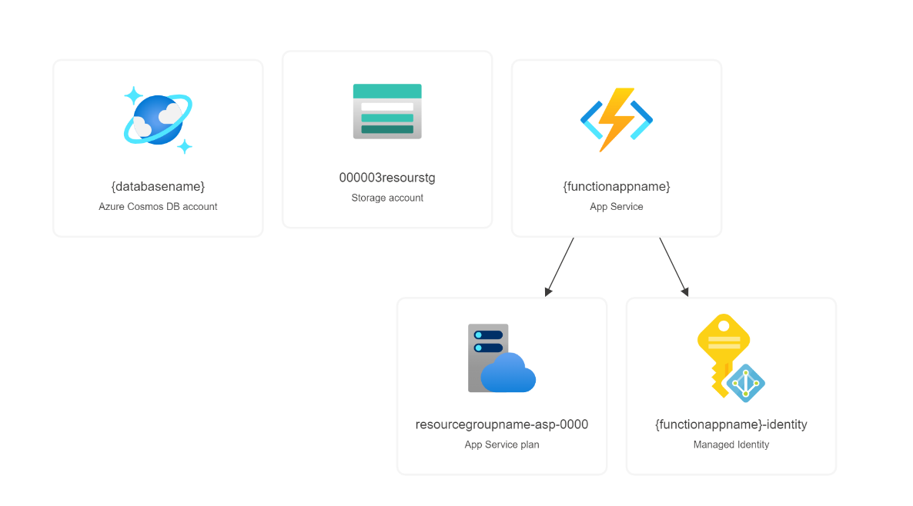
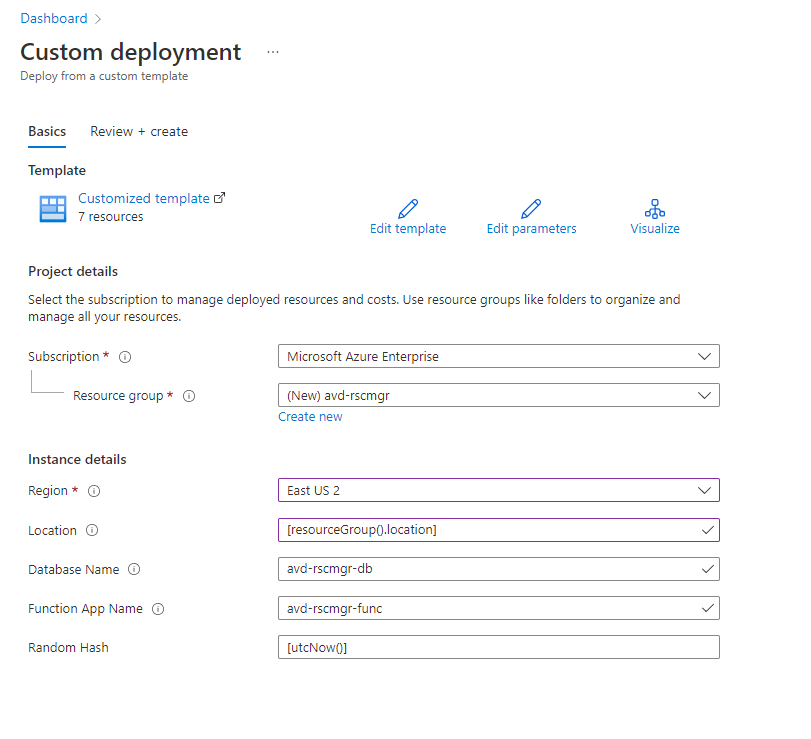

# How to deploy to Azure

## Overview

In order to utilize Azure Virtual Desktop Resource Manager, you'll need to have all of the resources created. These are the following resources needed to deploy:

- Azure CosmosDB account
  - _It's suggested that it be configured as **"Consumption (Serverless)"** to reduce costs._
- Azure Functions app
  - _It's suggested that it be configured as **"Consumption (Serverless)"** to reduce costs._
- Azure Storage Account
- User-assigned managed identity



## Deployment methods

### Using the pre-made template

The simplest solution will be to utilize [the Azure ARM template that's included in this repository here](../azure/deploy-avd-rscmgr.json) ([Bicep version](../azure/deploy-avd-rscmgr.bicep)). You can click the button below to deploy the template directly from the Azure Portal.

You will need to do the following:

- Specify an existing resource group or create a new resource group.
  - I **highly** suggest creating a new resource group.
- Specify the name you want the Azure CosmosDB account to be called.
- Specify the name you want the Azure Functions app to be called.

Here's an example:



#### With a pre-built ZIP package

> ⚠️ **Note:** Please be aware that this method utilizes the `WEBSITE_RUN_FROM_PACKAGE` configuration and uses the latest publicly available ZIP file from this repo ([Found here in the latest release](https://github.com/Smalls1652/SmallsOnline.AVD.ResourceManager/releases/latest)), which means you'll be deploying the Functions app I've built using CI/CD in GitHub.

[](https://portal.azure.com/#create/Microsoft.Template/uri/https%3A%2F%2Fraw.githubusercontent.com%2FSmalls1652%2FSmallsOnline.AVD.ResourceManager%2Fmain%2Fazure%2Fdeploy-avd-rscmgr.json)

Or with PowerShell:

```powershell
# Replace `-Location` with the location you want to use.
$rscGroup = New-AzResourceGroup -Name "insert-rscgroup-name-here" -Location "eastus2"

New-AzResourceGroupDeployment -ResourceGroupName $rscGroup.ResourceGroupName -Name "deployAvdRscMgr" -Mode "Incremental" -TemplateUri "https://raw.githubusercontent.com/Smalls1652/SmallsOnline.AVD.ResourceManager/main/azure/deploy-avd-rscmgr.json"
```

#### Just the Azure resources

> ⚠️ **Note:** This requires you to manually deploy the compiled code to the Functions app.

[](https://portal.azure.com/#create/Microsoft.Template/uri/https%3A%2F%2Fraw.githubusercontent.com%2FSmalls1652%2FSmallsOnline.AVD.ResourceManager%2Fmain%2Fazure%2Fdeploy-avd-rscmgr_no-package.json)

Or with PowerShell:

```powershell
# Replace `-Location` with the location you want to use.
$rscGroup = New-AzResourceGroup -Name "insert-rscgroup-name-here" -Location "eastus2"

New-AzResourceGroupDeployment -ResourceGroupName $rscGroup.ResourceGroupName -Name "deployAvdRscMgr" -Mode "Incremental" -TemplateUri "https://raw.githubusercontent.com/Smalls1652/SmallsOnline.AVD.ResourceManager/main/azure/deploy-avd-rscmgr_no-package.json"
```

For guidance on deploying the compiled code to the Functions app, you'll want to use one of the following methods:

- [VSCode - Publish to Azure](https://docs.microsoft.com/en-us/azure/azure-functions/functions-develop-vs-code?tabs=csharp#publish-to-azure)
  - Also: [@microsoft/vscode-azurefunctions - Deploy to Azure](https://github.com/microsoft/vscode-azurefunctions/blob/main/README.md#deploy-to-azure)
- [Visual Studio - Publish to Azure](https://docs.microsoft.com/en-us/azure/azure-functions/functions-develop-vs?tabs=in-process#publish-to-azure)
- [Through GitHub Actions](https://docs.microsoft.com/en-us/azure/azure-functions/functions-how-to-github-actions?tabs=dotnet)
  - ⚠️ **Heads up!**
    - You'll need to **fork** or **copy** this repo (You can use the _**Use this template**_ button) to do this. For either option, you'll need to add this repo as an upstream in your local `git` copy to keep it up-to-date with any updates.
